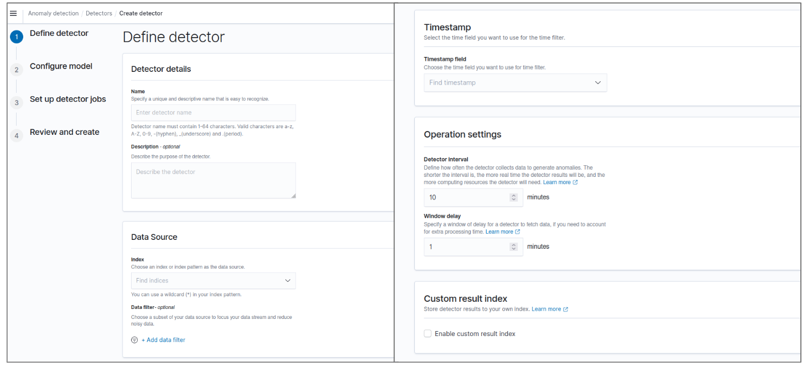
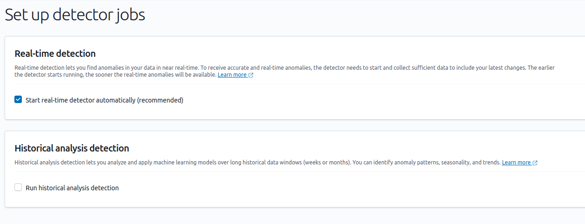

# Opensearch Plugin 가이드
* Opensearch Plugin 가이드는 Opensearch-Dashboards UI를 통해 접근할 수 있는 plugin을 기준으로 한다.
* Opensearch Plugins 중 Index Management와 Security의 경우 다른 가이드 문서에 작성되어 있기 때문에 제외한다.
   * index management의 index policy는 Opensearch 기본 가이드로 제공
   * security 기능은 Opensearch Role 설정 가이드로 제공 

## 목차
* [Query Workbench](https://github.com/chaejin-lee/install-opensearch/new/main/docs#query-workbench)
* [Anomaly Detection](https://github.com/chaejin-lee/install-opensearch/new/main/docs#anomaly-detection-%EC%9D%B4%EC%83%81-%ED%83%90%EC%A7%80) 
* [Alerting](https://github.com/chaejin-lee/install-opensearch/new/main/docs#alerting-%EC%95%8C%EB%A6%BC)
* [Observability](https://github.com/chaejin-lee/install-opensearch/new/main/docs#observability-%EA%B4%80%EC%B8%A1)
* [Reporting](https://github.com/chaejin-lee/install-opensearch/new/main/docs#reporting)

## Query Workbench
* 목적: Opensearch에서 기존의 Opensearch DSL이 아닌 SQL 구문으로 쿼리를 작성하여 원하는 정보를 조회하고 그 결과를 text, json, jdbc, csv 형식으로 저장할 수 있다.
* Query editor에 SQL로 쿼리를 작성 후 RUN을 클릭하면 Results에서 조회된 결과를 확인 할 수 있다.
* Download 버튼을 클릭하면 조회된 내용을 JSON, JDBC, CSV, Text 형식으로 저장하여 다운로드 할 수 있다.
* 비고:
   * opensearch-dashboards 1.2.X version에서는 multiline을 지원하지 않아 쿼리문은 한 줄로 작성해야한다.
   * 일부 지원하지 않는 내용이 있다. 참조: https://opensearch.org/docs/1.2/search-plugins/sql/limitation/

* ex) SELECT * FROM logstash-2022.07.01

## Anomaly Detection 이상 탐지
* 목적: time-series 데이터에서 Random Cut Forest(RCF) 알고리즘을 통해 사용자가 설정한 detector를 바탕으로 이상 현상을 감지한다.
* Detector(탐지기)를 생성한다
   * Detector details: detector 이름과 description을 작성한다.
   * Data Source: detector로 감시할 index 또는 index-pattern을 설정한다.
      * data filter를 통해 특정 label만 감시할 수 있도록 추가 설정이 가능하다.
   * Timestamp를 설정한다
   * Operation settings: detector가 이상 현상을 감시하는 주기를 설정할 수 있다. interval이 작을 수록 detector의 감지 결과는 real time에 더 가까워진다.
      * window delay: 데이터 수집 프로세스에 걸리는 시간과 detecor가 감지하는 데이터의 양을 조절하기 위해 delay를 추가로 설정할 수 있다. 
   * Custom result index: detector가 감지한 결과를 바탕으로 새로운 index를 생성할 수 있다.
 
* Model을 설정한다
   * Features: 이상 현상을 탐지하고자 하는 index의 log field를 설정하여 average(), count(), sum(), min(), max() 중 하나의 집계 메소드를 선택한다.
   * Categorical fields: 이상 현상을 특정 키워드나 ip field type으로 카테고리화 할 수 있다. detector가 생성된 이후에는 변경할 수 없다.
   * Sample anomalies: 데이터 샘플을 통해 현재 설정된 detector 설정을 바탕으로 이상 탐지 preview를 볼 수 있다.

* Detector job을 설정한다
   * Real-time detection: 권장 사항으로 이상 탐지를 실시간으로 진행한다.
   * Historical analysis detection: 실시간이 아닌 오랜 기간(몇 주 또는 몇 달)동안 적재된 데이터를 바탕으로 이상 현상에 대한 분석을 하고자 할 때 설정한다.
      * default로 설정된 기간은 1달 

* 생성된 detector가 initializing에서 running 상태로 바뀌면 Dashboard 메뉴를 통해 현황을 조회할 수 있다.
ex) opensearch에서 제공하는 sample data(sample-host-health-detector)를 이용한 cpu와 memory 사용량 이상 탐지 모니터링

## Alerting 알림
* 목적: 

## Observability 관측
* 목적:

## Reporting
* 목적:
