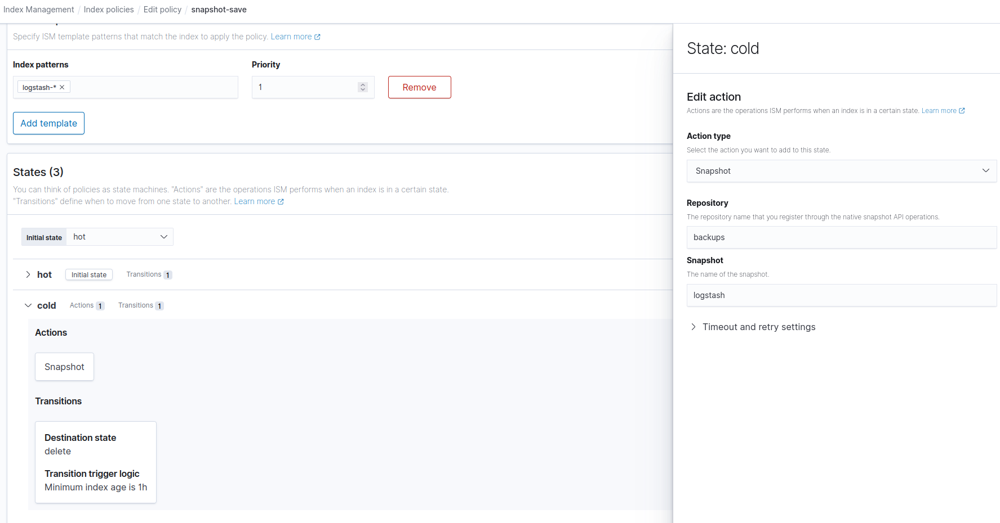

## Elasticsearch-Opensearch 데이터 마이그레이션 가이드
* 목적: 기존의 EFK stack으로 적재하고 저장한 index log data를 Opensearch에 데이터 손실 없이 옮긴다.

### Step 1. ElasticSearch backup repo 생성
* 기존에 사용한 [01_elasticsearch.yaml](../migration/01_elasticsearch.yaml)(예시용)에 snapshot repository 생성을 위한 설정을 추가한 후, es-cluster pod를 재기동한다.
* 예시1) elasticsearch/statefulset 추가 설정
```
volumeMounts:
  - name: es-config
    mountPath: /usr/share/elasticsearch/config/elasticsearch.yml
    subPath: elasticsearch.yml
  - name: backups-vol
    mountPath: /backups
    
 volumes:
      - name: es-config
        configMap:
          name: es-config
      - name: backups-vol
        persistentVolumeClaim:
          claimName: backups-es-cluster-0
           
  volumeClaimTemplates:
  - metadata:
      name: backups
      labels:
        app: elasticsearch
    spec:
      accessModes: ["ReadWriteMany"]
      resources:
        requests:
          storage: 50Gi
          
```

* 예시2) elasticsearch.yml Configmap 추가
```
apiVersion: v1
kind: ConfigMap
metadata:
  name: es-config
  namespace: kube-logging
data:
  elasticsearch.yml: |
    network.host: "0.0.0.0"
    path.repo: ["/backups"]

```

### Step 2. ES backup repo에 snapshot 생성
* ES snapshot 생성을 위한 shell script 실행

```bash
$ ./migration/snapshot.sh

```
### Step 3. OpenSearch에 backup repo 연동 및 restore
* [01_opensearch.yaml](../yaml/01_opensearch.yaml)에 snapshot repository 생성을 위한 설정을 추가한 후, install 가이드에 따라 설치를 진행한다.
* 예시1) opensearch/statefulset 추가 설정
```
volumeMounts:
  - name: backups-vol
    mountPath: /backups
    
 volumes:
   - name: backups-vol
     persistentVolumeClaim:
       claimName: backups-es-cluster-0       
```

* 예시2) opensearch-config ConfigMap 추가 설정
```
network.host: "0.0.0.0"
path.repo: "/backups"
```
* 설치 완료 후, OS에서 Snapshot 데이터를 불러오기 위한 shell script 실행

```bash
$ ./migration/restore.sh

```


### 비고
* [snapshot.sh](../migration/snapshot.sh)에서 저장하고자 하는 index-pattern을 추가할 수 있다.
* 예시) fluentd-* index-pattern 추가 시,
```
{
  "indices": "logstash-*", "fluentd-*" # 추가한 index-pattern
  "ignore_unavailable": true,
  "include_global_state": false
}

```

* 단, kibana의 system indices는 (ex) .kibana*) snapshot에 저장하지 않는다.
* dashboards와 동일한 system indices 이름을 사용하기 때문에 충돌하기 때문

## Opensearch Snapshot 가이드
* 목적: Opensearch에 적재한 index log data를 별도의 repository에 저장하여 관리한다.

### Step 1. OpenSearch backup repo PVC 마운트 설정
* [01_opensearch.yaml](../yaml/01_opensearch.yaml)에 snapshot repository 생성을 위한 설정을 추가한 후, os-cluster pod를 재기동한다.
* 예시1) opensearch/statefulset 추가 설정
```
volumeMounts:
  - name: os-config
    mountPath: /usr/share/elasticsearch/config/opensearch.yml
    subPath: opensearch.yml
  - name: backups-vol  # backup repository volume 마운트 추가
    mountPath: /usr/share/opensearch/backups
    
 volumes:
      - name: os-config
        configMap:
          name: os-config
      - name: backups-vol  # backup repository volume 추가
        persistentVolumeClaim:
          claimName: backups-os-cluster-0
           
  volumeClaimTemplates:  # backup repository 용 backups pvc 생성
  - metadata:
      name: backups
      labels:
        app: opensearch
    spec:
      accessModes: ["ReadWriteMany"]
      resources:
        requests:
          storage: 50Gi  # 임의로 설정한다.
          
```
* 예시2) opensearch-config ConfigMap 추가 설정
```
network.host: "0.0.0.0"
path.repo: "/usr/share/opensearch/backups" # repository path 추가
```

### Step 2. OS backup repo 생성
* OPENSEARCH_SERVICE_IP = opensearch의 service ip를 기입한다.

ex) backups repository 생성
```
curl -u admin:admin -k -XPUT https://{OPENSEARCH_SERVICE_IP}:9200/_snapshot/backups -H 'Content-Type: application/json' -d'
{
  "type": "fs",
  "settings": {
    "location": "/usr/share/opensearch/backups"
  }
}
'
```

### Step 3. OS backup snapshot 생성
ex) snapshot_1을 생성하여 logstash-*에 해당하는 인덱스를 repository에 저장
```
curl -u admin:admin -k -XPUT "https://{OPENSEARCH_SERVICE_IP}:9200/_snapshot/backups/snapshot_1?wait_for_completion=true&pretty" -H 'Content-Type: application/json' -d'
{
  "indices": "logstash-*", # snapshot으로 저장하고자 하는 index pattern을 입력
  "ignore_unavailable": true,
  "include_global_state": false
}
'
```

### Step 3-1. Dashboards UI에서 Index Policy를 이용해 특정 index pattern을 가진 index를 주기적으로 저장
*  Index Management > Index Policies > Create Policy 에서 Visual Editor로 설정을 진행한다.
*  ISM template 설정에서 Add template으로 해당 policy를 적용하고자 하는 index-pattern을 설정한다. ex) logstash-*
*  Edit State 설정에서 Actions에 add action을 클릭하여 action type에서 snapshot을 고른 후, repository 이름과 snapshot 이름을 설정한다.
*  이전 state의 transitions 설정에서 minimum index age 설정을 통해 인덱스가 생성된 후 minimum index age로 설정한 기간이 지나면 자동으로 snapshot이 실행된다.
    *  ex) 인덱스 생성 후 1일이 지나면 snapshot을 실행 후, 1시간이 지나면 인덱스를 삭제하는 policy 설정. 지워진 인덱스는 snapshot으로 별도로 저장되어 필요할 때 언제든 restore로 불러올 수 있다.
    *  index-policy 생성 예시 [snapshot-policy.json](../migration/snapshot-policy.json)


## Snapshot 조회, 복구, 삭제
* Opensearch-Dashboards UI의 Dev Tools 또는 api 콜을 통해 snapshot 조회, 복구 및 삭제를 할 수 있다.
### snapshot 조회
```
curl -u admin:admin -k -XGET "https://{OPENSEARCH_SERVICE_IP}:9200/_snapshot/backups/_all # 저장된 snapshot 전체 조회
curl -u admin:admin -k -XGET "https://{OPENSEARCH_SERVICE_IP}:9200/_snapshot/backups/snapshot_1 # 특정 snapshot 조회
```
* Dev Tools를 통해 조회 시
```
GET _snapshot/backups/_all # 저장된 snapshot 전체 조회
GET _snapshot/backups/snapshot_1 # 특정 snapshot 조회
```
### snapshot 복구
```
curl -u admin:admin -k -XDELETE "https://{OPENSEARCH_SERVICE_IP}:9200/_snapshot/backups/_all/_restore # 전체 snapshot 복구
curl -u admin:admin -k -XDELETE "https://{OPENSEARCH_SERVICE_IP}:9200/_snapshot/backups/snapshot_1/_restore # 특정 snapshot 복구
```
* Dev Tools를 통해 복구 시
```
POST _snapshot/backups/_all/_restore# 전체 snapshot 복구
POST _snapshot/backups/snapshot_1/_restore# 특정 snapshot 복구
```

### snapshot 삭제
```
curl -u admin:admin -k -XDELETE "https://{OPENSEARCH_SERVICE_IP}:9200/_snapshot/backups/snapshot_1 # 특정 snapshot 삭제
```
* Dev Tools를 통해 삭제 시
```
DELETE _snapshot/backups/snapshot_1 # 특정 snapshot 삭제
```
