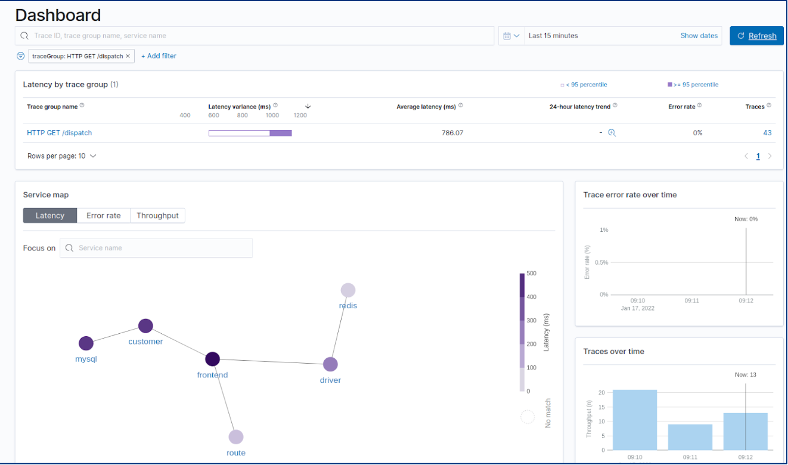

# Trace Analytics 사용 가이드
* 목적: Opentelemetry operator를 통해 application으로부터 trace 데이터를 수집하여 분석할 수 있다.

## Opentelemetry Operator
* 개요
   * Instrumentation을 통한 agent 및 Opentelemtry Collector 설정 관리
   * Trace data를 수집하고자 하는 pod에 inject annotation 추가를 통해 자동으로 agent 설치할 수 있도록 지원

## Prerequisites
* [Cert-Manager](https://github.com/tmax-cloud/install-cert-manager)

## 구성 요소
* Opentelemetry-Operator (ghcr.io/open-telemetry/opentelemetry-operator/opentelemetry-operator:0.56.0)
* Kube-rbac-proxy (gcr.io/kubebuilder/kube-rbac-proxy:v0.11.0)
    * operator deployment의 sidecar container
* Data-prepper (opensearchproject/data-prepper:1.5.0)

## Step 0. Opentelemetry-Operator 설치
* 목적: Opentelemetry-Operator 설치
* 순서:

1. [opentelemetry-operator.yaml](../trace_analytics/opentelemetry-operator.yaml)에 이미지 버전 설정
2. kubectl apply -f opentelemetry-operator.yaml 로 설치

## Step 1. Instrumentation CR 생성
* 목적: Instrumentation CR 설정
* 순서:

1. kubectl apply -f instrumentation.yaml 로 생성

* 비고: [instrumentation.yaml](../trace_analytics/instrumentation.yaml) 에서 각 파드에 inject할 agent의 이미지를 임의로 변경할 수 있다.

## Step 2. Opentelemetry-Collector CR 생성
* 목적: Opentelemetry-Collector CR 설정
* 순서: 

1. kubectl apply -f opentelemetry-collector.yaml 로 생성

* 비고: [opentelemetry-collector.yaml](../trace_analytics/opentelemetry-collector.yaml)에서 deployment mode를 변경할 수 있다. ex) sidecar, daemonset, deployment 현재 default 설정은 deployment

## Step 3. Data-prepper 설치
* 목적: Opentelemetry-Collector를 통해 받은 trace data를 OpenSearch의 document 형식으로 변환하여 Opensearch에 적재
* 순서: 

1. [data-prepper.yaml](../trace_analytics/data-prepper.yaml)에 이미지 버전 설정
2. kubectl apply -f data-prepper.yaml 로 설치

## Step 4. Pod에 Annotation 추가
* 목적: pod에 annotation을 통해 해당 pod의 trace data를 수집하기 위한 agent를 설치
* 아래의 예시에서는 JavaAgent 사용을 전제로 함.
* 비고: operator에서 지원하는 agent의 종류는 java, python, nodejs 

ex) Pod일 경우

```
apiVersion: v1
kind: Pod
metadata:
  name: myapp
  annotations:
    sidecar.opentelemetry.io/inject: "true"
    instrumentation.opentelemetry.io/inject-java: "kube-logging/java"
spec:
  containers:
  - name: myapp
```

ex) Deployment일 경우

```
apiVersion: apps/v1
kind: Deployment
metadata:
  name: my-app-deploy
spec:
  selector:
    matchLabels:
      app: my-app-deploy
  replicas: 1
  template:
    metadata:
      labels:
        app: my-app-deploy
      annotations:                                 ### annotation 추가를 spec > template > metadata 안에서 해야 함.
        sidecar.opentelemetry.io/inject: "true"
        instrumentation.opentelemetry.io/inject-java: "kube-logging/java"
```

ex) Multi-Container일 경우 (sidecar가 달려있는 container)

```
apiVersion: apps/v1
kind: Deployment
metadata:
  name: my-deployment-with-multiple-containers
spec:
  selector:
    matchLabels:
      app: my-pod-with-multiple-containers
  replicas: 1
  template:
    metadata:
      labels:
        app: my-pod-with-multiple-containers
      annotations:
        sidecar.opentelemetry.io/inject: "true"
        instrumentation.opentelemetry.io/inject-java: "kube-logging/java"
        instrumentation.opentelemetry.io/container-names: "myapp,myapp2"
    spec:
      containers:
      - name: myapp
        image: myImage1
      - name: myapp2
        image: myImage2
      - name: myapp3
        image: myImage3
```

## Step 5. OpenSearch-Dashboards UI에서 확인

